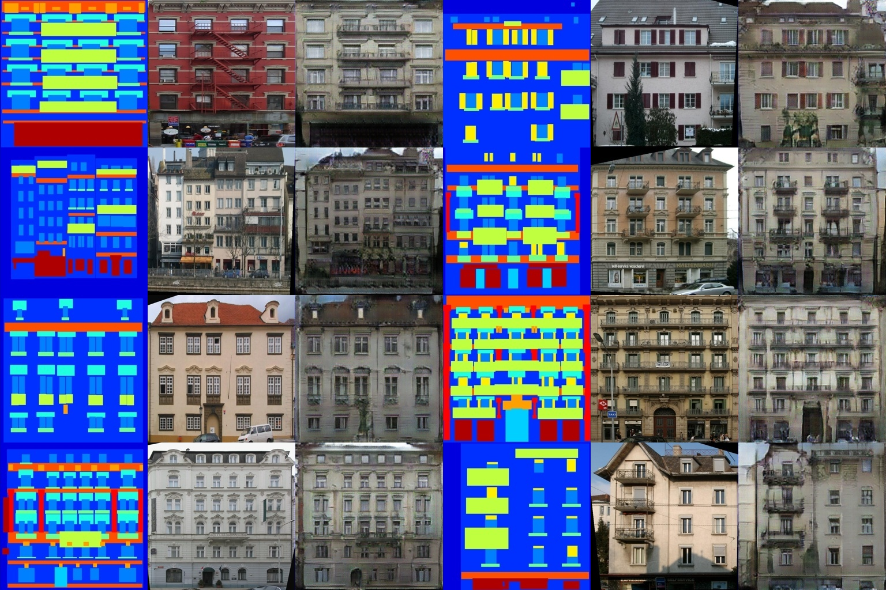

# pix2pix_implement_t
an implement of pix2pix model ([original paper](https://arxiv.org/abs/1611.07004))

trained on facades, with a few images deleted (saved in [acades](datasets/acades))

results saved in [results/](results/)

train the model: ```python train.py```
changing training option by editing [config](config/facades_train_config.yaml)

Prerequisites: ```python, numpy, torch, opencv-python, matplotlib, yaml```


